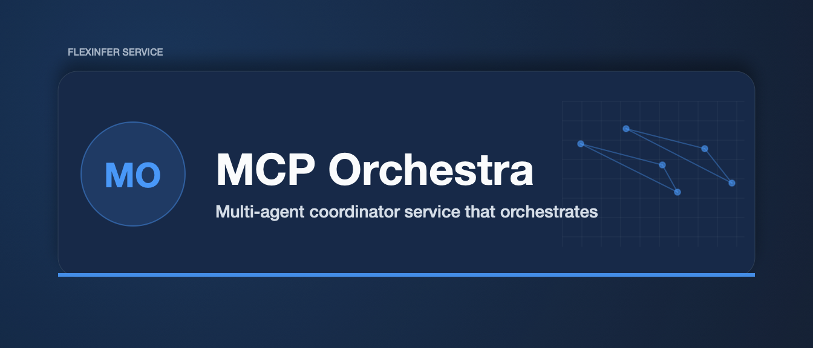

# MCP Orchestra

Multi-agent coordinator service that orchestrates multiple MCP servers as a unified agent swarm for complex, multi-step tasks.

## Overview

MCP Orchestra acts as a conductor for your MCP server fleet, enabling:
- **Task Decomposition**: Break complex requests into subtasks
- **Tool Chaining**: Route subtasks to appropriate MCP servers
- **Parallel Execution**: Run independent subtasks concurrently
- **State Aggregation**: Collect and merge results from multiple tools

## Architecture

```
┌─────────────────────────────────────────────────────────────┐
│                     MCP Orchestra                           │
├─────────────────────────────────────────────────────────────┤
│  ┌─────────────┐  ┌─────────────┐  ┌─────────────────────┐  │
│  │   Planner   │──│ Coordinator │──│     Executor        │  │
│  │  (LLM/DAG)  │  │  (State)    │  │ (Connection Pool)   │  │
│  └─────────────┘  └─────────────┘  └─────────────────────┘  │
│                           │                                  │
│                    ┌──────┴──────┐                          │
│                    │   Registry  │                          │
│                    │  (Tools DB) │                          │
│                    └─────────────┘                          │
└─────────────────────────────────────────────────────────────┘
                            │
         ┌──────────────────┼──────────────────┐
         ▼                  ▼                  ▼
   ┌───────────┐     ┌───────────┐      ┌───────────┐
   │ MCP Server│     │ MCP Server│      │ MCP Server│
   │ (loom-fs) │     │ (loom-k8s)│      │ (loom-git)│
   └───────────┘     └───────────┘      └───────────┘
```

## Features

- **DAG-based Planning**: Automatically determine task dependencies
- **Registry Integration**: Discover tools from fi-mcp-gateway registry
- **Connection Pooling**: Reuse MCP connections across requests
- **Execution Modes**:
  - Sequential: Execute tasks in order
  - Parallel: Execute independent tasks concurrently
  - Streaming: Stream results as they complete
- **Observability**: Prometheus metrics, structured logging

## Installation

```bash
go install gitlab.flexinfer.ai/services/mcp-orchestra/cmd/orchestra@latest
```

## Usage

### Start the Orchestrator

```bash
# Load registry from fi-mcp-gateway
orchestra serve --registry /path/to/registry.yaml --port 8090

# Or connect to running gateway
orchestra serve --gateway ws://localhost:8080 --port 8090
```

### Execute a Multi-Tool Task

```bash
# Via CLI
orchestra run --task "Read config.yaml, validate schema, then apply to k8s"

# Via API
curl -X POST http://localhost:8090/v1/tasks \
  -H "Content-Type: application/json" \
  -d '{"prompt": "Read config.yaml, validate schema, then apply to k8s"}'
```

### Define a Task DAG

```yaml
# task.yaml
name: deploy-config
steps:
  - id: read
    tool: filesystem/read_file
    args:
      path: config.yaml

  - id: validate
    tool: schema/validate
    depends_on: [read]
    args:
      schema: config-schema.json
      content: ${{ steps.read.output }}

  - id: apply
    tool: kubernetes/apply
    depends_on: [validate]
    args:
      manifest: ${{ steps.read.output }}
```

```bash
orchestra run --file task.yaml
```

## Configuration

| Env Var | Description | Default |
|---------|-------------|---------|
| `ORCHESTRA_REGISTRY` | Path to MCP registry YAML | `./registry.yaml` |
| `ORCHESTRA_GATEWAY` | WebSocket URL of fi-mcp-gateway | - |
| `ORCHESTRA_PORT` | HTTP API port | `8090` |
| `ORCHESTRA_LOG_LEVEL` | Log verbosity (debug, info, warn, error) | `info` |
| `ORCHESTRA_METRICS_PORT` | Prometheus metrics port | `9090` |
| `ORCHESTRA_POOL_SIZE` | Max connections per MCP server | `10` |
| `ORCHESTRA_TIMEOUT` | Default task timeout | `5m` |

## API Reference

### POST /v1/tasks

Execute a task using natural language or DAG definition.

**Request:**
```json
{
  "prompt": "string",           // Natural language task description
  "task": { ... },              // Or explicit task DAG (optional)
  "timeout": "5m",              // Task timeout
  "stream": true                // Stream results as SSE
}
```

**Response (streaming):**
```json
{"event": "step_start", "step_id": "read", "tool": "filesystem/read_file"}
{"event": "step_complete", "step_id": "read", "output": "..."}
{"event": "task_complete", "result": { ... }}
{"event": "task_error", "error": "..."}
{"event": "task_cancelled", "error": "task cancelled"}
```

### GET /v1/tools

List all available tools from connected MCP servers.

### GET /v1/tasks

List tasks, optionally filtered by status.

**Query params:**
- `status`: pending, running, completed, failed, cancelled

### GET /v1/tasks/:id

Get status of a running or completed task.

### POST /v1/tasks/:id/cancel

Cancel a running or pending task.

## Development

```bash
# Run locally
go run ./cmd/orchestra serve --registry ./testdata/registry.yaml

# Run tests
go test -race -cover ./...

# Build
go build -o bin/orchestra ./cmd/orchestra
```

## License

MIT
